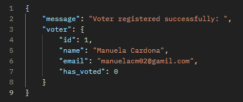
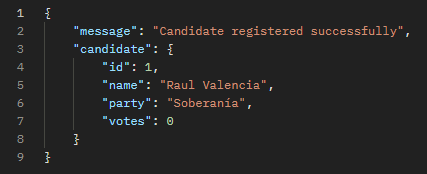
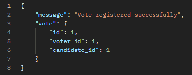
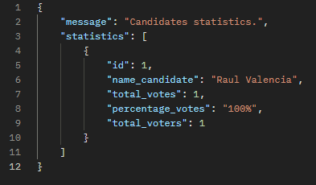

# SistemaDeVotacion
Este repositorio se creará con el fin de construir un producto Backend enfocado en un control de votaciones.

# Instrucciones para iniciar el proyecto de manera local
- El modelo está basado en una base de datos relacional(SQL).
Por lo tanto aquí dejaré las querys necesarias para la creación de la base de datos de manera local:
- (
    create database voting_system;
    use voting_system;

    CREATE TABLE voter (
        id int PRIMARY KEY auto_increment,
        name varchar(100) not null,
        email varchar(120) not null,
        has_voted boolean not null
    );

    CREATE TABLE candidate(
        id int primary key auto_increment,
        name varchar(100) not null,
        party varchar(100),
        votes int
    );

    CREATE TABLE vote (
        id INT PRIMARY KEY AUTO_INCREMENT,
        voter_id INT,
        candidate_id INT,
        FOREIGN KEY(voter_id) REFERENCES voter(id) ON DELETE CASCADE,
        FOREIGN KEY(candidate_id) REFERENCES candidate(id) ON DELETE CASCADE
    );
)

En mi caso utilicé XAMPP para inicializar un servidor local que me permite ejecutar SQL mediante MYSQL, lo que facilita la gestión de bases de datos para mis aplicaciones.

# Documentación de la API
- En la estructura principal del proyecto podrán encontrar un archivo llamado Sistema de votaciones.postman_collection, en el cual estará documentado cada endpoint
  y así lograr una ejecución más rápida en la prueba del mismo.

# Ejemplos de uso de la API

